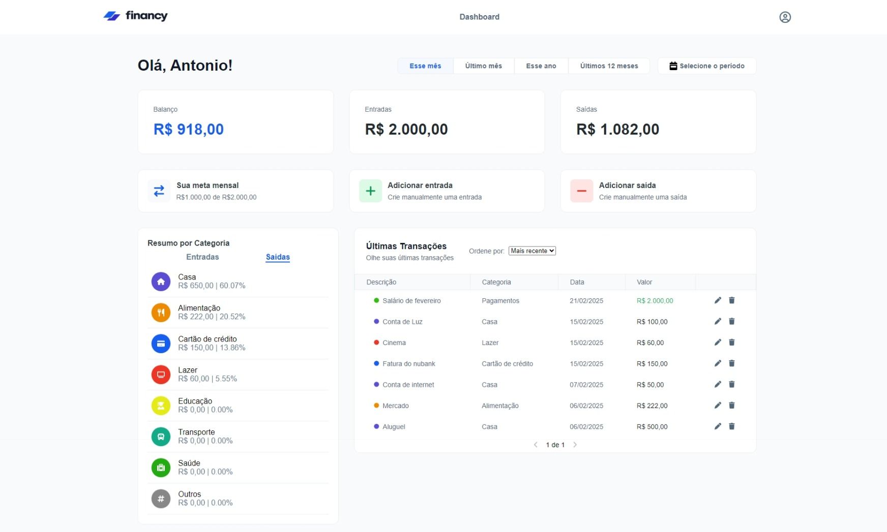

# Financy

## 📸 Captura de Tela



## 📌 Sobre o Projeto

Financy é um projeto de controle financeiro desenvolvido em ReactJS com TypeScript. Ele utiliza styled-components para o CSS-in-JS, proporcionando uma experiência de desenvolvimento modular e estilização dinâmica. Este projeto foi inspirado em um layout moderno e intuitivo que facilita o gerenciamento das finanças pessoais.

## 🌐 Acesso ao Projeto

[Acesse aqui](https://financy-frontend.vercel.app/)

## 🚀 Funcionalidades

- **Dashboard Resumida:**

  - Exibição de saldo atual.
  - Visão geral das receitas e despesas.
  - Comparativos percentuais mensais.
  - Comparativos por categorias de receitas e despesas.

- **Gestão de Transações:**

  - Adição manual de receitas.
  - Adição manual de despesas.

- **Gastos e receitas por Categoria:**

  - Exibição de gastos e de receitas por categorias.

- **Últimas Transações:**

  - Lista das últimas transações com descrições, métodos de pagamento, datas e valores.

- **Período Personalizado:**

  - Filtro para visualização de dados por período (mês atual, mês passado, ano atual, últimos 12 meses, período personalizado).

- **Meta de gastos mensal:**

  - Adição manual de meta de gastos mensal.

## 🛠 Tecnologias Utilizadas

- **ReactJS**
- **TypeScript**
- **Styled Components**
- **Redux Toolkit**

## 📦 Instalação e Uso

1. Clone o repositório:
   ```sh
   git clone https://github.com/antooniodev/financy-frontend
   ```
2. Acesse o diretório do projeto:
   ```sh
   cd financy-frontend
   ```
3. Instale as dependências:
   ```sh
   npm install  # ou yarn install
   ```
4. Variáveis de ambiente:
    Em um arquivo .env adicione as seguintes variáveis que irão apontar para a api do financy
    ```sh
    VITE_BACKEND_URL=""
    ```   
5. Inicie o projeto:
   ```sh
   npm run dev  # ou yarn dev
   ```

Acesse o projeto em seu navegador:

```
http://localhost:5173/
```

## 📜 Estrutura do Projeto

```bash
src/
 ├── assets/         # Imagens, ícones e outros arquivos estáticos
 ├── components/     # Componentes reutilizáveis
 ├── pages/          # Páginas da aplicaçãoZ
 ├── entities/       # Entidades dos dados
 ├── middlewares/    # Middlewares utilizados nas chamadas à API.
 ├── services/       # Serviços e chamadas à API
 ├── store/          # Gerenciamento de estado com Redux
 ├── utils/          # Funções utilitárias
 ├── styles/         # Estilizações globais e temas
 ├── main.tsx        # Ponto de entrada da aplicação
```

## 🛠 Contribuição

Contribuições são bem-vindas! Para contribuir:

1. Faça um fork do projeto
2. Crie uma branch para sua feature: `git checkout -b minha-feature`
3. Commit suas alterações: `git commit -m 'Adiciona minha feature'`
4. Envie para o repositório: `git push origin minha-feature`
5. Abra um Pull Request

## 📄 Licença

Este projeto está licenciado sob a [MIT License](LICENSE).

## 🎨 Créditos

Designer: [Figma](https://www.figma.com/community/file/1357072393691339649/financy-personal-finances-dashboard)

---

Feito com ❤️ por [Antonio Victor](https://github.com/antooniodev).

