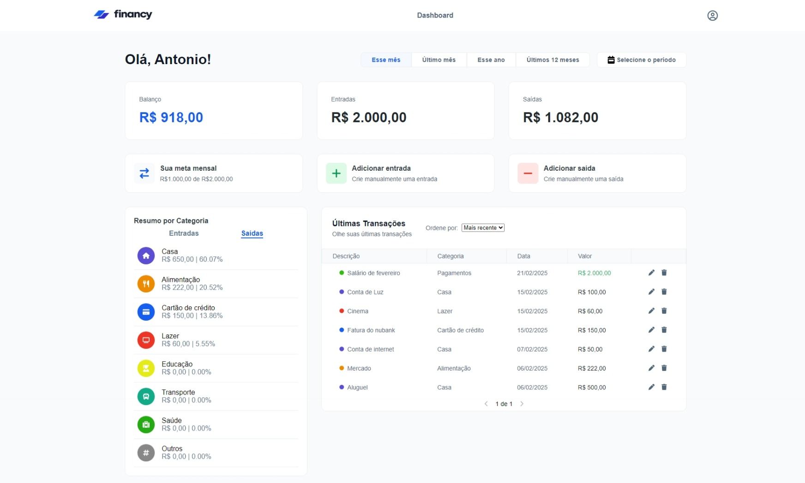

# Financy

## 📌 Sobre o Projeto

Financy é um projeto de controle financeiro composto por uma Dashboard desenvolvida em ReactJS com TypeScript e uma API desenvolvida em Node.js com Express e Prisma ORM. O objetivo do projeto é oferecer uma interface intuitiva para gestão financeira, permitindo o controle de receitas, despesas e análises financeiras detalhadas.

## 📸 Captura de Tela



## 🚀 Funcionalidades

### Dashboard
- **Exibição de saldo atual**
- **Visão geral das receitas e despesas**
- **Comparativos percentuais mensais**
- **Comparativos por categorias**
- **Gestão de transações** (adição de receitas e despesas)
- **Meta de gastos mensal**
- **Filtro por período personalizado**
- **Últimas transações registradas**

### API
- **Endpoints para CRUD de transações**
- **Endpoints para busca de categorias**
- **Autenticação via JWT**
- **Persistência de dados com PostgreSQL**
- **Validação de dados com Yup**

## 🛠 Tecnologias Utilizadas

### Dashboard
- **ReactJS**
- **TypeScript**
- **Styled Components**
- **Redux Toolkit**

### API
- **Node.js**
- **Express**
- **TypeScript**
- **Drizzle ORM**
- **PostgreSQL**
- **Yup**

## 📦 Como Rodar o Projeto com Docker Compose
🔹 Observação: É necessário ter o Docker instalado para rodar a demo.
1. Clone o repositório:
   ```sh
   git clone https://github.com/antooniodev/financy
   ```
2. Acesse o diretório do projeto:
   ```sh
   cd financy
   ```
4. Execute o Docker Compose:
   ```sh
   docker-compose up --build
   ```
5. Acesse a aplicação:
   - **Dashboard:** [http://localhost:5173](http://localhost:5173)
   - **API:** [http://localhost:3333](http://localhost:3333)
   
## 📜 Documentação da API

A documentação da API foi gerada via Postman. Você pode acessá-la pelo link abaixo ou importar o arquivo `.json` disponível em /api/financy.postman.json

🔗 [Documentação Postman](https://documenter.getpostman.com/view/23306405/2sAYdoFT8b)

## 📜 Estrutura do Projeto

```bash
financy-monorepo/
 ├── api/               # Backend (Node.js, Express, Prisma)
 ├── dashboard/         # Frontend (React, TypeScript)
 ├── docker-compose.yml # Configuração do Docker Compose
 ├── README.md          # Documentação do projeto
```

## 🛠 Contribuição

Contribuições são bem-vindas! Para contribuir:

1. Faça um fork do projeto
2. Crie uma branch para sua feature: `git checkout -b minha-feature`
3. Commit suas alterações: `git commit -m 'Adiciona minha feature'`
4. Envie para o repositório: `git push origin minha-feature`
5. Abra um Pull Request

## 📄 Licença

Este projeto está licenciado sob a [MIT License](LICENSE).

---

Feito com ❤️ por [Antonio Victor](https://github.com/antooniodev).

